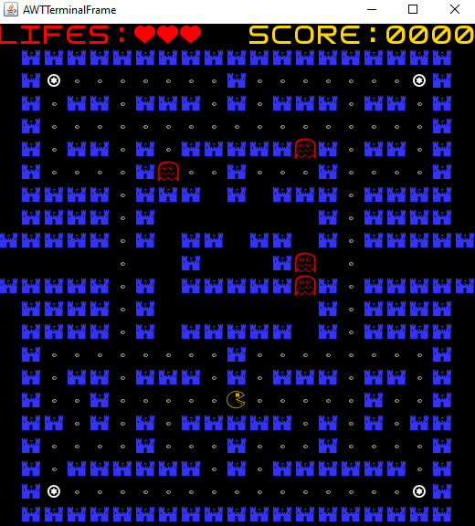
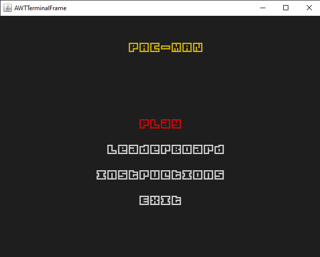

# PacMan

## Game Description

**PacMan** is an action maze chase video game; the player controls the eponymous character through an enclosed maze. The objective of the game is to eat all of the dots placed in the maze while avoiding four ghosts that pursue Pac-Man.

## FEATURES
- [x] Menu - When the game is initialized a Menu is displayed (the player chooses between playing, seeing leaderboard or quit)
- [x] Movement - PacMan is able to move in all directions when the arrow keys are pressed.
- [x] Power-ups - Give PacMan the power to kill enemies ghosts and make the ghosts rune away from PacMan.
- [x] Ghosts - The ghosts appear in the maze and follow PacMan.
- [x] Borders of the Map - When PacMan crosses the borders of the map, it appears on the opposite side.
- [x] Score - When the player picks food, power-ups and kills ghosts, he gains points.
- [x] Lives - The player has an amount of lives, that decreases everytime a ghost hits him.
- [x] Game Over - When the player runs out of lives, the game ends.
- [x] Instructions - A page that shows the basic controls for the game.
- [x] Leaderboard - When the user loses, his score is saved to a file.
- [x] SoundTrack - Play background music when user is playing
- [x] Sounds - Play sounds for various activities.
## Screenshots
The following screenshots ilustrate the general look of our game, as well as the functionalities:

### Game Preview

### Menus
**Initial Menu**

